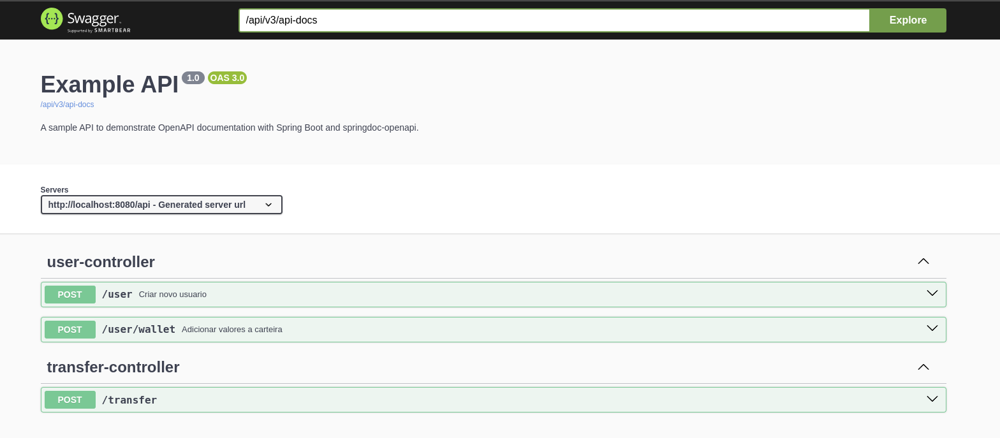

Visão geral do projeto/desafio:
    o projeto foi criado para simular uma API de transferencias de valores entre usuarios. 
Visando um cenário real onde compradores podem enviar valores para lojistas, onde:
 - cada usuario deve ter documentos/email unicos no sistema
 - usuarios podem enviar dinheiro para lojistas e entre usuarios
 - lojistas nao podem enviar dinheiro
 - o usuario deve ter saldo valido para realizar a transferencia


Para rodar o projeto: 
    Dentro do diretório onde o projeto está salvo, deve-se rodar o seguinte comando:

    docker-compose up -d --build

O Swagger a aplicação vai estar disponivel na seguinte url: 

    http://localhost:8080/api/swagger-ui/index.html#



Configuraçoẽs importantes:
    por padrão a aplicação vai subir com o profile ``dev``, assim caso alguma configuração necessite de ser alterada, pode ser feita no arquivo ``application-dev.properties`` disponivel no diretorio ``resources`` 
- Cache: 
    ``` app.cache.ttl define o time-to-live(tempo em que a informação vai ficar armanezada) do cache em minutos. ``` 
    ``` app.cache.type define o tipo de cache que será utilizado. Podendo ser ´stub´ ou ´redis´. Por padrão a API utiliza o redis```
- Serviços externos:
  - por padrão, a API iria tentar fazer requisições HTTP para serviços reais disponibilizados para a validar a 
  transferencia e notificar que foi concluida. Porem esses serviços podem não estar mais disponiveis durante a sua execução do projeto. Para isso foi criada a seguinte configuração:
  ``app.mock-services`` Podendo receber os valores ``true`` ou ``false``. Por padrão a aplicação vai estar com o valor ``true``, isso implica que não serão feitas requisições para serviços reais e sim para implementações que simulam as respostas. 
  - Exemplo:
  ```java
    @Service
    @ConditionalOnProperty(
    value="app.mock-services",
    havingValue = "true")
    public class MockTransferValidatorImpl implements TransferValidatorService {
        @Override
        public boolean validate(UUID transferId) {
        return true;
    }
  }
  ```
  - Exemplo da implementação real (quando a propriedade estiver com o valor ``false``: 
  ```java
  @Service
  @Log4j2
  @ConditionalOnProperty(
  value="app.mock-services",
  havingValue = "false")
  public class PicPayTransferValidatorImpl implements TransferValidatorService {

   private final PicPayTransferValidatorService client;

   public PicPayTransferValidatorImpl(PicPayTransferValidatorService client) {
       this.client = client;
   }

    @Override
    public boolean validate(UUID transferId) {
       try {
        ApiResponse response = client.validate(transferId);
        return response.message().equalsIgnoreCase("autorizado");
       } catch (Exception e) {
         log.error("Error when validating transfer: {}", e.getMessage());
         throw new ExternalServiceException("Unable to validate Transfer: "+ e.getMessage());
       }
    }
  }